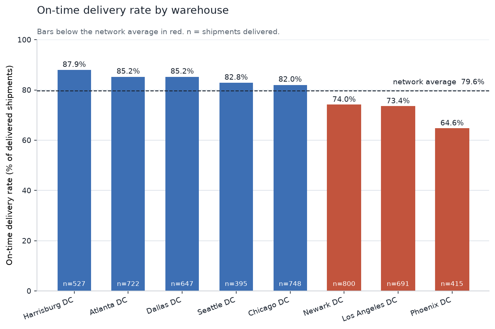
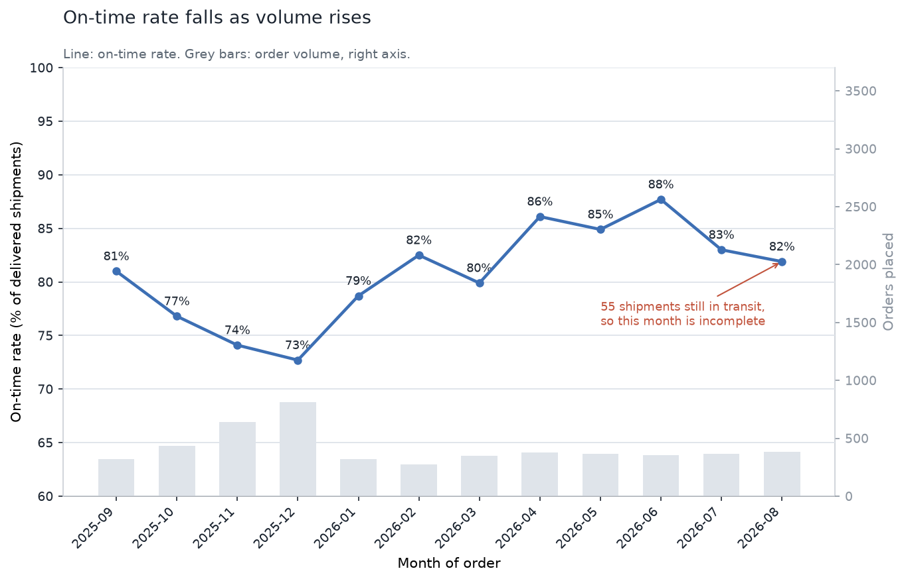
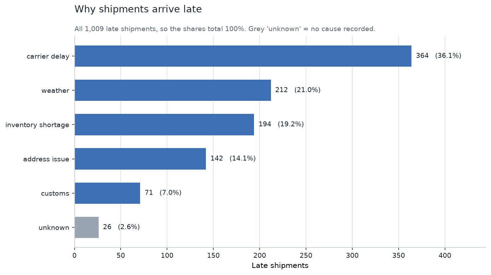
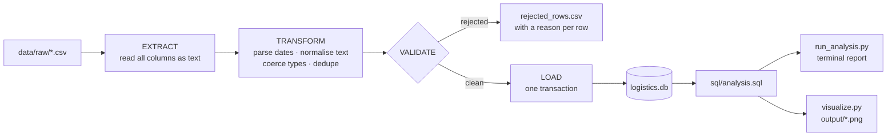
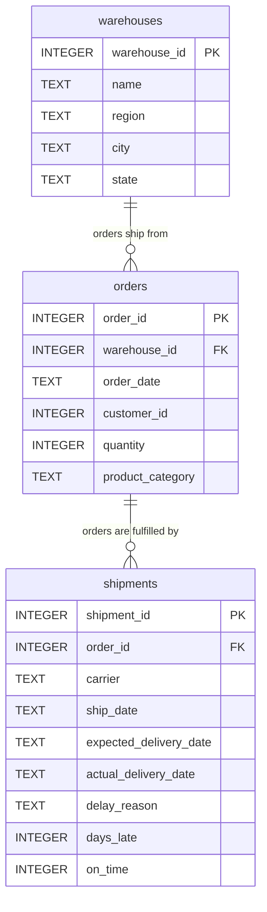

# Logistics ETL Pipeline

A Python pipeline that takes messy shipment CSVs, cleans and validates them, loads them
into a SQLite database with real constraints, and reports on delivery performance. It
handles what extracts actually contain in practice: four date formats mixed through every
date column, 32 spellings of five carrier names, duplicate rows, blank fields. Anything it
can't trust goes
to a rejects file with a reason attached instead of being dropped quietly. The load runs
inside one transaction and is idempotent, so running it twice leaves the database exactly
as it was.

> ### The data is synthetic
> Every number here comes from `src/generate_data.py`, a seeded generator that invents
> 5,000 orders across 8 fictional warehouses. No real logistics data is involved. The delay
> patterns were planted on purpose so the analysis has something to find, so read the
> figures below as a demonstration of the pipeline rather than as anyone's real carrier
> performance.

## Charts



Reliability per site. Anything below the network average is red.



On-time rate over 12 months, with order volume behind it.



What causes delays. Grey is late shipments with no cause recorded.

## Architecture



Every column is read as text first, because letting `read_csv` guess types on dirty data is
how `order_id` ends up a float. Normalisation runs before deduplication, since dedup
compares whole rows and two records that mean the same thing only match once they look the
same.

### Database schema



The two foreign keys behave differently on purpose. Deleting a warehouse that still has
orders is refused, because that would orphan the demand history. Deleting an order takes
its shipments with it, because a shipment owned by nothing means nothing.

The schema carries 10 CHECK constraints covering ISO date validity, positive quantities, a
fixed `delay_reason` vocabulary, and timeline sanity, plus 6 indexes. SQLite does not index
foreign keys for you, so both FK columns are indexed by hand.

`days_late` and `on_time` are worked out by the ETL and stored rather than computed at
query time, since almost every report filters on them. Both stay NULL while a shipment is
in transit, and a CHECK makes sure either both are known or neither is.

## Setup

Windows, `cmd`:

```bat
git clone https://github.com/DiegoAC06/logistics-etl-pipeline.git
cd logistics-etl-pipeline
python -m venv venv
venv\Scripts\python.exe -m pip install -r requirements.txt
```

Generate the data, build the database, then report on it:

```bat
venv\Scripts\python.exe src\generate_data.py
venv\Scripts\python.exe src\etl.py
venv\Scripts\python.exe src\run_analysis.py
venv\Scripts\python.exe src\visualize.py
```

Tests:

```bat
venv\Scripts\python.exe tests\test_schema_drift.py
venv\Scripts\python.exe tests\test_rejection_rules.py
```

The generator is seeded and the dependencies are pinned, so a fresh clone reproduces the
exact numbers below.

## Key Findings

*All figures come from the synthetic dataset described above.*

**A data quality bucket was hiding the worst delivery performance in the network.** 36
shipments arrived with a blank carrier and got the sentinel `'Unknown'`. On the headline
metric they look fine, better than any real carrier at 86.1% on time, but when they are late
they run 5.2 days late on average, the highest figure anywhere in the report. The next is
4.55. None of it showed at first, because the carrier ranking filtered `'Unknown'` out for
not being a carrier. True enough, and it also meant the ranking quietly summed to 4,909 of
4,945 delivered shipments. It is kept in now, pinned to the bottom. Missing metadata
correlated with the worst outcomes, and the tidy looking filter was hiding exactly that.

**Carriers vary far more than warehouses.** OnTrac delivers 55.6% on time across 363
shipments against FedEx's 85.6% across 1,396. Showing the on time rate next to average
lateness separates two different problems: DHL misses less often than USPS but stays late
about a day longer when it does.

**The worst pairing is worse than either half of it.** Phoenix DC via OnTrac is 69.1% late
over 94 shipments, while Phoenix overall runs 35.4% late and OnTrac 44.4%. It only shows up
once warehouse and carrier are crossed.

**Volume and reliability move together.** On time rate drops to 72.7% in December against
87.7% in June, tracking order volume of 814 against 357.

Not a finding: the `worst_days` column reads 14 for almost every carrier. That is the
generator's maximum delay value, not a pattern in the data.

## Design Decisions

### Why SQLite

The dataset is single writer, single machine, and fits in memory. SQLite gives real
constraints, transactions and SQL with no server to run, and the database file regenerates
from the CSVs in seconds. Inserts go through `executemany` rather than pandas' `to_sql`,
because `to_sql` commits internally, so an outer transaction wrapped around several of them
buys no atomicity at all. I checked that rather than assuming it.

### Delete and reload

The CSVs are a complete snapshot, so the database should mirror them. `if_exists="replace"`
would drop each table and let pandas rebuild it from inferred dtypes, destroying every CHECK
constraint, both foreign keys and all six indexes while appearing to work perfectly. An
upsert would keep rows deleted upstream, so a full refresh would drift out of sync.
`DELETE FROM` inside one transaction keeps `schema.sql` as the only definition of the tables
and leaves the old contents alone if anything fails partway.

### Foreign keys are off by default

SQLite has shipped with foreign key enforcement disabled since it was added in 3.6.19, for
backwards compatibility: schemas written before then declared keys that were never checked,
and enforcing them on upgrade would have broken working software. The pragma is per
connection and isn't stored in the file, so every connection has to set it or the
constraints do nothing. `connect()` sets it and reads it back, failing loudly if it didn't
take, because a check that silently isn't checking is worse than no check.

### Schema drift detection

The loader only creates tables when they are missing, so an edited `schema.sql` would never
reach an existing database and the ETL would load against stale definitions. A hash of
`schema.sql` is stamped into `PRAGMA user_version` at creation and compared on later runs.
A derived hash rather than a version number you bump by hand, because a number you have to
remember to bump fails in exactly the situation this is meant to catch. On a mismatch the
run stops with instructions and deletes nothing, since rebuilding is the operator's call.

### Rejected rows

Bulk inserts abort as a whole and name no row, so every constraint the schema declares is
checked in pandas first: unparseable dates and numbers, duplicate primary keys with
conflicting values, non positive quantities, impossible timelines, broken foreign keys. Each
failure writes the original row to `data/processed/rejected_rows.csv` with a reason and the
offending value, and the file is rewritten every run so a stale copy can't be mistaken for a
clean result. A shipment whose parent order was rejected gets rejected too rather than
failing at insert, and where a primary key conflicts the first row wins, which keeps the key
alive so child rows aren't orphaned.

Blank values in non critical columns get sentinels rather than deletion (`'Unknown'` carrier,
`'unknown'` category, `customer_id = 0`), because dropping an order would orphan its
shipment. They show up in aggregates by design, and as the first finding shows, that
visibility is the point.

## Repository layout

| Path | Purpose |
|---|---|
| `src/generate_data.py` | Seeded synthetic data generator, stdlib only |
| `src/etl.py` | Extract, transform, validate, load |
| `src/run_analysis.py` | Runs `analysis.sql`, prints formatted tables |
| `src/visualize.py` | Renders the three charts |
| `sql/schema.sql` | Table definitions, constraints, indexes |
| `sql/analysis.sql` | Seven named analytical queries |
| `tests/` | Schema drift and rejection rule tests, plain asserts, no framework |

Built and tested on Python 3.12.3, with pandas 3.0.5 and matplotlib 3.11.1.
